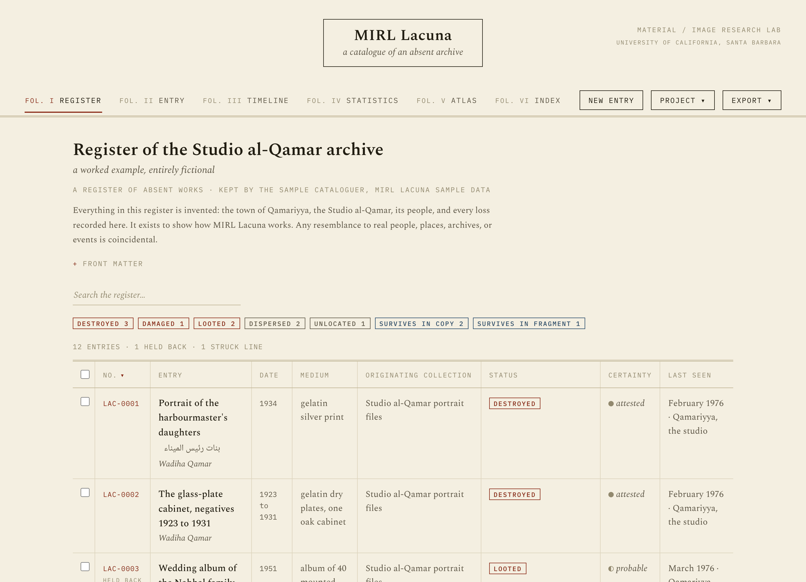
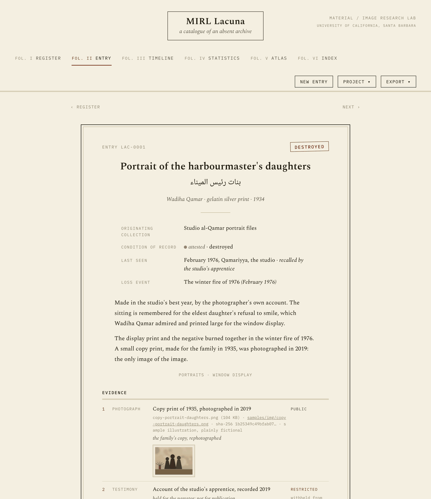
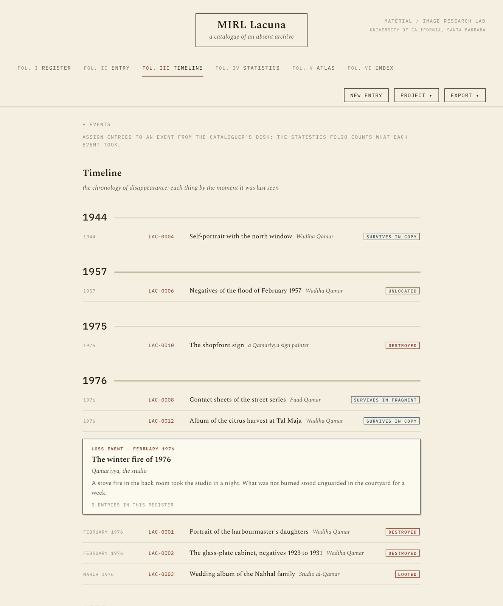
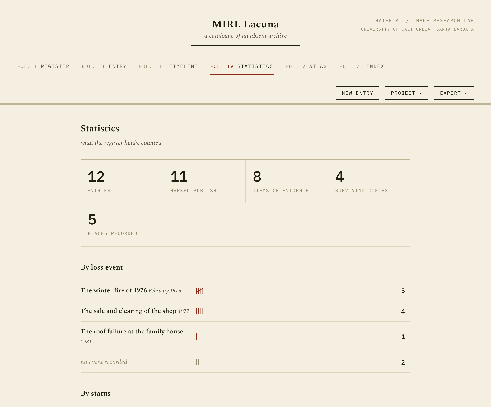
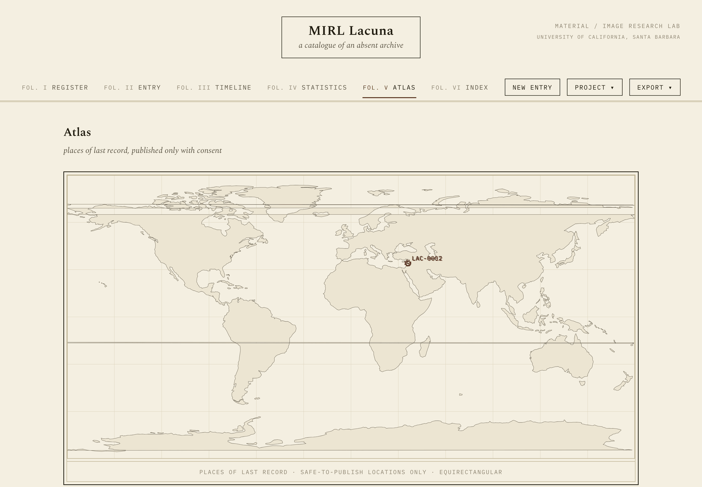
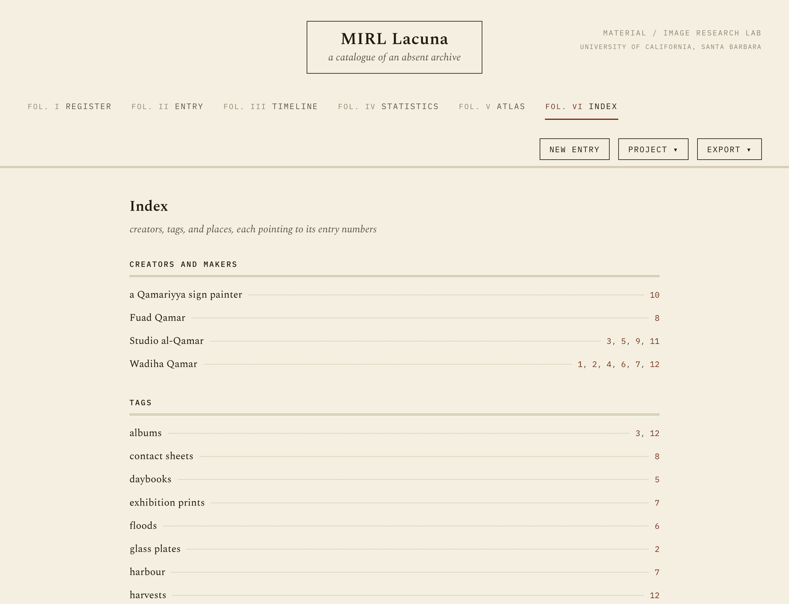

# MIRL Lacuna

**A catalogue for what is gone.**

MIRL Lacuna is a free, local-first cataloguer for archives that no longer
exist. Most collection software assumes the object is on a shelf; Lacuna
assumes it is not. Each entry records a work that has been destroyed, damaged,
looted, dispersed, or simply lost track of, together with the evidence for
saying so, the people and places involved, and whatever copies or fragments
survive. Absence is a first-class state here, not an error.

It was built for people in the **arts, humanities, and cultural heritage**:
historians, archivists, curators, conservators, community researchers, and
students, working at the scale the big registries do not serve, one scholar
or one community at a time. **You do not need to know how to code to use it.**

The tool opens with a small sample already loaded, the register of an entirely
fictional photographic studio, so you can see how everything works before you
add anything of your own. The easiest way to use it is the live copy at
[mirl-ucsb.github.io/mirl-lacuna](https://mirl-ucsb.github.io/mirl-lacuna/):
open it and begin. It is a static page that receives nothing; your register
stays in your browser and in the files you save. If you would rather run your
own copy of the tool, this repository is a template (see
[Making it your own](#making-it-your-own)).



*The register, opened on the fictional sample: stamped statuses, certainty
marks, a held-back entry, and checkboxes for batch work.*

---

## What you might use it for

- A **lost collection**: reconstructing, entry by entry, what an archive held
  before a fire, a flood, a war, or a demolition took it.
- **Conflict losses**: works last seen in a museum, a studio, or a family
  house, with testimony and photographs held at the contributors' consent.
- **Colonial dispersal**: objects removed from a community, now scattered
  across institutions, with the surviving copies and their holders listed
  against each entry.
- A **last-seen register** for looted or missing objects: where, when, and on
  whose word.
- **Catalogues raisonnés of destruction**: the dignified record of an artist's
  works that no longer exist.
- Teaching with absence: a seminar building a register as a way of thinking
  about what archives fail to keep.

---

## The six folios

**Register.** The whole archive as a ruled table: number, title, date, medium,
originating collection, status, certainty, last seen. Search it, filter it by
status with the stamped marks, sort it, and click any line to open the entry.
Tick several lines and a batch bar appears for assigning an event, adding a
tag, or setting a status across all of them at once, which matters right
after an import when forty entries belong to the same fire. Publication is
deliberately not among the batch actions: that consent is given one entry at
a time.

**Entry.** Each record is set as a memorial notice inside a mourning frame:
the title (in any language), what the thing was, what became of it, when it
was last seen and on whose word, the narrative, the evidence, and any
surviving copies. It is a tombstone, not a 404. Below the notice sits **the
cataloguer's desk**, the working form; everything you type appears in the
notice above as you type it.

Entries are **struck, not deleted**. A real ledger never erases; it cancels
visibly. A struck entry stays in the register as a cancelled line, ruled
through, kept out of every export, restorable at any time, and its number is
never reused. (Outright removal exists for mistaken entries, behind a
confirmation.)



*A memorial notice: the stamp, the Arabic parallel title, the loss event,
and evidence with its sha-256 fingerprint, thumbnail, and consent marks.*

**Timeline.** The chronology of disappearance: every entry ordered by the
moment it was last seen, year by year, with the loss events set among them as
notices. The events themselves (a fire, a sale, a flood) are kept on this
folio: name, date, place, and a note, so the destruction is treated as a
historical object in its own right, not a phrase repeated across records.



*The chronicle: each thing at the moment it was last seen, with the loss
events set among the entries.*

**Statistics.** The reckoning: counts by status, by certainty, by consent,
and by loss event, set with tally strokes.



**Atlas.** Places of last record on a world plate, with a gazetteer beneath.
Only places marked for publication are ever plotted; the rest are counted,
not shown.



**Index.** The back of the book: alphabetical indexes of creators, tags, and
places, each line pointing to its entry numbers with dotted leaders, the way
a printed register ends.



---

## What an entry records

- **Status**, from a controlled vocabulary: destroyed, damaged, looted,
  dispersed, unlocated, survives in copy, survives in fragment.
- **Certainty**: attested, probable, or uncertain, because a register of
  losses should say how it knows.
- **Titles in any language.** Parallel titles each carry a language code, and
  right-to-left scripts (Arabic among them) set themselves correctly in both
  the form and the notice.
- **Last seen**: a date, a place, and a source, the most recent moment anyone
  can vouch for.
- **Sightings and reports**: a dated dossier under the entry ("offered for
  sale, 1977", "seen in a private collection, 2003"), each report marked as
  *supporting* or *complicating* the stated status, because post-conflict
  knowledge is plural and the register should hold contradiction rather than
  resolve it away.
- **A history of its fate.** When a status changes, the old one is kept, with
  the date and a line on why: the ledger never erases. A recovery shows as a
  recovery ("formerly unlocated, to June 2026").
- **An investigation log**: dated working notes on the search itself, where
  the negative results live (the deposit with no list, the office that says
  no file exists). These never leave the working file.
- **Extent**: an optional count (1,140 glass plates; 40 albums) so a
  collection-level entry can be counted in objects, not just entries, and
  statistics can answer "how much was lost" the way a loss assessment must.
- **A loss event**: which fire, sale, flood, or clearance the entry belongs
  to, drawn from the project's event list.
- **Relations**: typed links to other entries (part of, contains, copy of,
  has copy, related to). You record one direction; the other side is implied
  and shown automatically, so the glass-plate cabinet *contains* its
  negatives without anyone typing it twice.
- **Narrative note, tags**, and the usual descriptive fields (creator, date,
  medium, originating collection).

---

## Evidence, on the contributors' terms

Each entry carries an evidence list: photographs, documents, citations,
testimony. For every item you can attach a file or point to a web address,
and Lacuna records:

- a **sha-256 fingerprint** of the exact file, computed in your browser, so
  the entry stays evidentially tethered to its source. The file itself never
  leaves your machine; the register keeps its name, the hash, and (for
  images) a small thumbnail.
- **rights** and a **consent state**: public, restricted, or embargoed.
- for web evidence, a **Wayback snapshot** on request: one click asks the
  Internet Archive to save the address now, and the archived copy's address
  is kept beside the original, so the evidence survives its source going
  dark.

**Restricted and embargoed evidence never enters an export.** Not the CSV,
not the public data file, not the finding aid. It lives only in your own
project file. This is a default, not an option to remember. An embargo can
carry a **date**: when it passes, Lacuna points it out gently, and the
consent state still changes only by your hand, because a lapsed date is a
prompt for a human decision, not a switch.

The same defaults govern the **entry itself**. Every entry starts **held
back from publication**: catalogued, counted, searchable in your working
register, but absent from every export until you tick *publish this entry*.
A community can keep a whole record while withholding it, and the finding
aid says so plainly: "3 further entries are recorded in the working register
and not published here," which is itself a statement.

**Places** have three states. *Withheld* (the default) keeps a location out
of everything. *Approximate* publishes it rounded to about 10 km, findable
but not targetable. *Exact* publishes it precisely. Locations can endanger
people and sites; nothing is published until you say how.

You do not need to find latitude and longitude by hand. Type a place into an
entry, a town ("Beirut") or a specific place whose name ends in a town
("Institute of Palestine Studies, Beirut"), and Lacuna sets it on the atlas
at a city-level, approximate point, resolved against a gazetteer bundled in
the tool, on your machine, sending nothing anywhere. For a precise pin on a
specific building you can press **Look up online**, which (only then, only
because you asked) sends the place name to OpenStreetMap. Coordinates you
type by hand are always respected. In the working register the atlas shows
everything you have located, drawing entries not yet cleared for publication
faintly, so you see your work while the exports stay strict.

---

## The people who remember

Research on disappeared archives runs on people, and the people matter more
than the paperwork. Under **Project · Sources and narrators**, the register
keeps the people it rests on: each with a **publication alias** ("the
studio's apprentice"), an identity and contact that **never publish or
export**, and a consent note in their own terms: what may be used, what must
wait, until when.

Link evidence and sightings to their narrator from the cataloguer's desk,
and the notice credits the alias ("told by the studio's apprentice"). Then
the view every researcher eventually needs is one click away: **everything
that rests on this person's word**, across the whole register, with a single
action to restrict all of their public material when consent is withdrawn or
in doubt. Consent is a relationship over time, not a checkbox, and the
register knows whom it has relationships with.

---

## Locking the file

The working file holds restricted testimony and, now, real identities. From
**Project · Lock this register**, a passphrase encrypts the file at rest:
the browser autosave, the live disk file, and every saved project file
(AES-GCM, with the key derived from your passphrase at 600,000 rounds of
PBKDF2, all in the browser). Opening a locked register asks for the
passphrase and shows nothing until it is given.

Plainly, what it does and does not do: it protects the file **at rest**, on
a laptop that is lost, copied, or opened at a checkpoint. While the register
is open in your browser, it is open. There is no recovery if the passphrase
is lost. And exports are publications, so the finding aid, the spreadsheet,
and the public data remain plain by design.

---

## Surviving copies

Where some version of a lost work still exists, list its holders: institution,
identifier, a web address, and (when the holder publishes one) a **IIIF**
address. Paste a IIIF image or manifest and the notice gets a **Look** button
that opens the copy as a deep-zoom image, tile by tile, right inside the
entry. Plain image links work too.

---

## Bringing work in

Reconstruction rarely starts from nothing; it starts from an old inventory,
a dealer's list, an accession ledger. From the **Project** menu:

- **Import entries (.csv).** A spreadsheet becomes draft entries. Lacuna
  reads the column names it recognises (title, creator, date, medium,
  status, last seen, place, and so on, including its own CSV export) and
  tells you which columns it could not place. Imported entries arrive held
  back from publication, like everything else here.
- **Merge a project (.json).** Two people catalogue in parallel, no server
  involved, then one merges the other's file. New entries are added; where
  the same entry differs in both registers, the conflicts are laid out side
  by side and you choose which version stands, with the newer one suggested,
  or **keep both** when the same number turns out to name two different
  works: theirs joins under a fresh number, with its relations following.
  Each register can set its own **mark (siglum)** in the front matter, the
  way manuscripts carry sigla, so registers cite one another without
  colliding.
- After either, Lacuna quietly flags **possible duplicates**: new entries
  whose title and creator match an existing one, with a one-click choice to
  relate them, strike the newcomer as a duplicate, or keep both.
- **Check evidence files.** Point Lacuna at the files in your evidence
  folder and it verifies each against the sha-256 fingerprint recorded when
  it was attached: a fixity check, in the preservation sense. Single items
  can also be verified from their entry.

---

## Saving and exporting

Your register is **one JSON file**, edited in the browser and autosaved
locally as you work. From the **Project** menu you can save it to disk and
open it again anywhere; nothing is uploaded, ever.

Two more layers of fieldwork insurance:

- **Keep the file on disk.** In Chromium browsers (Chrome, Edge), Lacuna can
  save continuously to a `.json` you choose, alongside the browser autosave,
  and offer to resume the same file next session. Elsewhere the menu item
  simply does not appear and the autosave carries on.
- **It works offline.** After the first visit, the whole tool (fonts and
  sample included) is cached in the browser, so the register opens and works
  with no connection at all.

From the **Export** menu:

- **Finding aid (.html)**: the whole register as a single, self-contained
  page (fonts included), ready for a website, an email attachment, or a USB
  stick. It carries the register, every notice, the timeline, the statistics,
  the atlas, and the index, with all restricted material and unpublished
  places withheld.
- **Print as a memorial book**: the register composed for paper, through the
  browser's print dialog (choose *Save as PDF*). A cover leaf from the front
  matter, one notice per page, and the register and index as appendices: the
  thing communities hand each other at meetings. Consent applies as in every
  export.
- **Notice for circulation**: one open entry as a one-page printed appeal,
  with its image, when and where it was last seen, and whom to tell. The
  memorial notice mourns; this one asks. Evidence consent and place
  publication apply as everywhere.
- **Spreadsheet (.csv)** of the register, for sorting and counting elsewhere.
- **Public data (.json)**, the machine-readable register with consent applied.
- **Print this view**, for paper copies of the register or a single notice.

Every entry also writes its own **citation**, in Chicago, MLA, APA, or
BibTeX, naming the work, its fate, and the register that records it.

---

## Running it

MIRL Lacuna is a plain web page with no build step and nothing to install.

- The simplest way: **double-click `index.html`** to open it in your browser.
- If your browser is cautious about local files, or you want to share it on
  the web, serve the folder instead. From the Lacuna folder:

  ```bash
  python3 -m http.server 8000
  ```

  then visit `http://localhost:8000`. It also runs as-is on **GitHub Pages**;
  to put your own copy there, see the next section.

---

## Making it your own

For most people the [hosted copy](https://mirl-ucsb.github.io/mirl-lacuna/) is
all they need, and it is the simplest place to start. Because Lacuna is a
static page with no server behind it, using the hosted copy is exactly as
private as running your own: it receives nothing, and your register stays on
your machine. Running your own copy is worth it when you want a home under
your own name, a version that cannot change under you, customization, or an
offline deployment. There are three ways to run it, from lightest to most
settled:

1. **Just open it.** Use the [hosted copy](https://mirl-ucsb.github.io/mirl-lacuna/),
   or download this repository and double-click `index.html`. Your register
   lives in your browser and in the project files you choose to save. Nothing
   is sent anywhere, on either path.
2. **Your own copy of the tool.** Use the template to put Lacuna under your
   account, then turn it on at **Settings → Pages → Deploy from branch →
   main / root**. Your copy runs at `your-name.github.io/your-repo/` with no
   edits; the paths are already relative. Choose this for a stable, branded
   home, or a shared instance for a lab or a class. Set the register's title,
   compiler, and mark (siglum) in the front matter inside the app.
3. **Publish a register.** When a register is ready to be seen, use
   **Export → Finding aid** for one self-contained page, or **Export →
   Public data** for the consent-applied JSON, and put that wherever you
   like. Only what you marked for publication travels.

**Where your data lives, and where it must not.** This is the one thing to be
clear about. The entries you type live in your browser, and in the project
files and locked files you save to disk. They do **not** become part of your
GitHub copy, and they should not. A register can hold restricted testimony,
the identities of narrators, and places unsafe to publish; committing the
working file to a repository, even a private one, copies all of that onto
servers you do not control, which is exactly what the consent model and the
lock exist to prevent. Keep the working file local, lock it before it leaves
your desk, and let only the consent-filtered exports go out. The template
gives you the tool, not a place to store the people in it.

Two practical notes. A copy made from the template starts its own history
and does not track this one, so later versions here will not reach it on
their own; to take an update, replace the code files from a fresh download.
And if you publish your copy under your own name, edit
[`CITATION.cff`](CITATION.cff) to credit yourself, and remove the `doi:`
line, which points to this tool rather than to your register.

---

## The sample register

The bundled sample records the losses of **Studio al-Qamar of Qamariyya**, a
photographic studio that never existed. The town, the studio, its people, and
every loss in the register are invented, and the sample says so on its own
front page; any resemblance to real people, places, archives, or events is
coincidental. The five evidence images are drawn from scratch, plainly
synthetic, and their sha-256 hashes are true hashes of the shipped files.

To regenerate the sample, run `python3 samples/make-samples.py` (needs
[Pillow](https://python-pillow.org)).

---

## Technical reference

- **One JSON document per project**: `{ format: "mirl-lacuna", version: 1,
  project: {...}, records: [...] }`. The project carries the front matter
  and the loss events (`events: [{ id, name, date, place, note }]`). Records
  carry titles (with language codes), descriptive fields, status, certainty,
  last-seen, an `eventId`, typed `relations` (one direction stored, the
  inverse computed), narrative, tags, a location whose `publish` field is
  `withheld`, `approximate`, or `exact`, an evidence list (type, file
  metadata or URL, sha-256, rights, consent with an optional embargo `until`
  date, optional `sourceId`, note, thumbnail), dated `sightings` with a
  bearing on the status, an append-style `statusHistory`, a private `log`,
  an `extent` (amount and unit), surviving copies (institution, identifier,
  IIIF and web addresses), and the `publish` and `struck` flags. The project
  also carries `sources` (alias, identity, contact, consent; only the alias
  survives into any export) and a `siglum` for entry numbering. Files saved
  by earlier versions load cleanly; the old boolean `safe` becomes `exact`.
- **Autosave** uses `localStorage`, debounced; the project file on disk is
  the durable copy. Hand-edited or older files are normalized on load.
- **Hashing** uses WebCrypto's SHA-256 with a small pure-JS fallback.
  Thumbnails are made on a canvas at 280 px and stored as compact JPEG data
  URLs inside the project file.
- **Exports** are filtered through a public clone of the data: only entries
  marked `publish` and not struck are included; evidence is kept only when
  its consent state is `public`; approximate locations are rounded to one
  decimal degree and withheld ones removed; relations survive only when both
  ends are published, so a public entry never reveals a held-back one. The
  finding aid inlines the stylesheet and embeds the fonts as data URLs, so
  the single file stands alone.
- **CSV import** matches header names case-insensitively after stripping
  punctuation (`title`, `creator`/`maker`/`artist`, `date`, `medium`,
  `origin`/`collection`, `status`, `certainty`, `last_seen_date`/`place`/
  `source`, `narrative`/`notes`, `tags`, `place`, `latitude`, `longitude`,
  `id`); its own register export round-trips. **Merge** reconciles by entry
  id: identical entries pass silently, new ones are added, and true
  conflicts are decided by hand, defaulting to the newer `modified` stamp.
- **Deep zoom and IIIF** are handled by
  [OpenSeadragon](https://openseadragon.github.io) (vendored in `vendor/`,
  no network needed). IIIF Image `info.json` addresses are used directly;
  Presentation manifests (v2 and v3) are resolved to their first image
  service. The source must allow cross-origin access, which almost all IIIF
  servers do.
- **The atlas** is an equirectangular SVG plate. The coastline is Natural
  Earth 1:110m land (public domain), converted once to a single SVG path by
  `vendor/make-land.py`; the app itself never touches the network.
- **Right-to-left scripts** are handled with `dir="auto"` on inputs and
  per-string direction detection in the rendered notice; Arabic text is set
  in Noto Naskh Arabic, vendored alongside Spectral and IBM Plex Mono in
  `fonts/`.
- **The lock** is WebCrypto end to end: PBKDF2 (SHA-256, 600,000 iterations,
  random salt) derives an AES-GCM 256 key that seals the autosave, the disk
  file, and saved projects into a `mirl-lacuna-locked` envelope. The key
  lives only in memory for the session; nothing about the passphrase is
  stored anywhere.
- **The live file on disk** uses the File System Access API where it exists,
  with the file handle kept in IndexedDB so the same file can be resumed
  (with your permission) next session. The browser autosave is unaffected
  and remains the fallback everywhere else.
- **Offline use** is a small hand-written service worker (`sw.js`): code and
  styles fetch network-first so updates arrive when there is a connection;
  fonts, vendored libraries, and the sample images are cache-first.
- **Geocoding** resolves a typed place against a gazetteer bundled in the
  repo (`vendor/gazetteer.js`, built from GeoNames cities, rounded to about a
  kilometre), entirely in the browser. The resolver matches the whole string,
  then comma-separated segments last first, treating a trailing country name
  as the country slot rather than a same-named town. The optional online
  lookup uses OpenStreetMap's Nominatim, only on an explicit press.
- **No data leaves your machine.** Everything runs in the browser. The only
  network requests Lacuna ever makes are the ones you ask for: opening a
  IIIF copy, fetching a URL to hash it, asking the Internet Archive to save
  one, or pressing Look up online to geocode a place. Typing a place resolves
  offline and sends nothing.

### Layout

```
mirl-lacuna/
├── index.html          # the page
├── sw.js               # offline support
├── css/style.css       # the ledger
├── js/
│   ├── model.js        # vocabularies, state, autosave, sha-256, thumbnails
│   ├── geocode.js      # type a place, resolve it to a point (offline + opt-in online)
│   ├── register.js     # the ruled table, filters, front matter
│   ├── record.js       # the memorial notice + the cataloguer's desk + IIIF
│   ├── timeline.js     # the chronicle, and the keeping of loss events
│   ├── stats.js        # tallies
│   ├── atlas.js        # the world plate and gazetteer
│   ├── indexes.js      # the back of the book
│   ├── citation.js     # Chicago / MLA / APA / BibTeX per entry
│   ├── importers.js    # CSV import, project merge, duplicates, fixity
│   ├── exporters.js    # finding aid, memorial book, CSV, public JSON
│   └── app.js          # routes, menus, dialogs, wiring
├── vendor/             # openseadragon.min.js · land.js · gazetteer.js (+ generators)
├── fonts/              # Spectral, IBM Plex Mono, Noto Naskh Arabic (woff2)
├── samples/            # the fictional studio register + its generator
└── docs/               # the screenshots in this README
```

---

## Citing this tool

This repository carries a [`CITATION.cff`](CITATION.cff) file, so GitHub's
**Cite this repository** button (in the sidebar of the repo page) will give
you a reference in APA or BibTeX form. Every release is archived on
[Zenodo](https://doi.org/10.5281/zenodo.20651020); the DOI
`10.5281/zenodo.20651020` always resolves to the latest version. A
[`CHANGELOG`](CHANGELOG.md) records each release, nothing erased. In a
note, cite it as:

> Jeff O'Brien, *MIRL Lacuna: a catalogue of an absent archive*, version
> 1.5.0, Material / Image Research Lab, UC Santa Barbara, 2026,
> https://doi.org/10.5281/zenodo.20651020.

---

Built at the [Material / Image Research Lab](https://mirl.arthistory.ucsb.edu),
Department of History of Art & Architecture, UC Santa Barbara.
Released under the MIT License. OpenSeadragon is BSD-licensed; the coastline
is Natural Earth (public domain); the place gazetteer is built from
[GeoNames](https://www.geonames.org) (CC BY 4.0); Spectral, IBM Plex Mono,
and Noto Naskh Arabic are under the SIL Open Font License.
